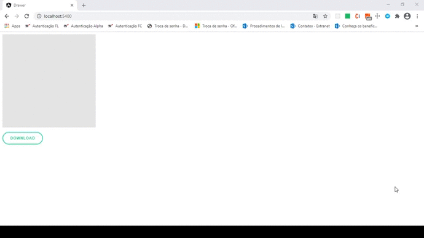

# :pencil: Angular Drawer
> This project is a example of how implement a drawer/signature component in Angular.  

  

## Table of contents
* [Apresentation](#apresentation)
* [Technologies](#technologies)
* [Setup](#setup)
* [Features](#features)
* [Status](#status)

## Apresentation

## Technologies
* Angular

## Setup
In the project directory, you can run:

``npm install``
Install the dependencies

``ng serve``
Runs the app in the development mode.
Open http://localhost:4200 to view it in the browser.

The page will reload if you make edits.
You will also see any errors in the console.

## Features
* Draw
* Download the draw

## Status
This project is being developed in my free time, feel free to up pull request and contribute to this project
